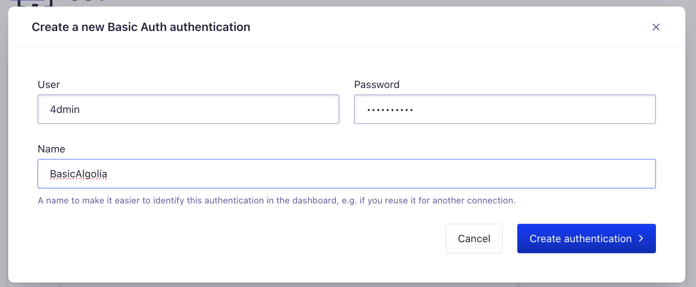

# Building Cool Searching UIs with Algolia and React-InstantSearch

# What are we going to do?

We're gonna create a search app using Algolia, and their amazing library, InstantSearch. Our tech stack will be NextJS, as it will help us to upload the data we need to Algolia, creating the UI alongside TailwindCSS.

We're gonna pick some characters from a videogame (Genshin Impact) and display them in a fancy way, being able to click around to filter and expand our character's data.

You ready? I'm not.

Let's go!

# Setting Up Algolia

## 1. Sign up!

Sign up to Algolia. Not gonna explain that part. It's easy! You can do it just by clicking on the Sign Up button in their page, and using your Google Account.

## 2. Basic Setup


Wait until your dashboard loads.


Here, we'll be able to create our index, which stores our data. I'll create mine with the name `hero-villains-and-co`, as you can see it in the picture. Hit on `Create Index`, and wait until `Import your records` is available.

We can do this step in many, many ways. Algolia offers us plenty of connectors and libraries, but we're gonna focus on an specific use case to take advantage of NextJS as a fullstack framework.


Click on `Upload records`, and select `Add connector`. You'll be redirected to the `Connectors` tab of `Data Sources`.


In my experience, many times records are stored into a single `.csv` file, so we're going to do it that way. Select `CSV` option, and press `Connect`. It will display a new screen, where you need to click on `Get Started` to start configuring.

### 2.1. Data Source Configuration

Before even thinking on how our data is going to look like (because I haven't thought of it yet), we'll start developing our endpoint.

In this new screen, you'll see different fields that we need to set up.


First one is asking if our data is protected. We want to consider this as somewhat sensitive data we don't want people downloading freely. To protect it, we'll be using Algolia's suggestion (basic auth) to authenticate and authorize access to our `.csv`.

#### 2.1.1. `.csv` API route.

This is a great moment to do some hands on. I'll assume you don't have NextJS background, but that won't save you from reading the docs at least a little bit if any doubts come up to you or I miss a step. Hopefully, you already have it installed, otherwise, go check the official [Get Started Installation Guide](https://nextjs.org/docs/getting-started/installation).

Open up your terminal, and go to the folder where you want your project to live in. Execute the following:

```
npx create-next-app@latest algolia-instantsearch --typescript --tailwind --eslint --app --no-src-dir --import-alias="@/*"
```

As you see, there are many options. Normally, you'd set them up manually while Vercel's scaffolding tool run, but you can also skip those steps using the command above.

Once the installation is finished, we can finally code a little bit.

Let's first serve the `.csv` file.

Inside your `app` directory, create the following file: `api/csv/route.ts`.

> ⚠️ **For development purposes ONLY**, create a `data.csv` file right next to the route. This will generally be inside a secure path, generated by some other piece of software. **Don't recreate this** in a real production environment.

Feel free to populate correctly `data.csv`, or just leave some headers there to see if they are actually being downloaded.

You might also copy the file from this repository. You should already know where is located.

Going back to the API endpoint, you'll need to read the file. NextJS has its own preferred way of doing it, which you can find [here](https://vercel.com/guides/loading-static-file-nextjs-api-route).

Copy and paste the following code.

```
import { NextResponse } from "next/server";
import { promises as fs } from "fs";

export async function GET() {
  const file = await fs.readFile(
    process.cwd() + "/app/api/csv/data.csv",
    "utf8"
  );

  return new NextResponse(file, {
    headers: {
      "content-type": "text/csv",
    },
  });
}
```

This will only get the file, and then return it.

What if we test it?

Run `npm run dev` in your terminal, go to your browser and get into `http://localhost:3000/api/csv`, and check how the file is downloaded!

Exciting, isn't it? Should be ready, but we still need to add some sort of auth mechanism. Specifically for this, we'll catch only on this route.

> ⚠️ Again, **for development purposes only**, and not over-extend this post, we'll use hardcoded values. User and password should be generated for each user/entity (in this case, Algolia), using secure mechanisms of storing and data extraction.

The resulting code can look like this. Feel free to do all the modifications you want to make it prettier!

```
import { NextRequest, NextResponse } from "next/server";
import { promises as fs } from "fs";

export async function GET(req: NextRequest) {
  const authHeader = req.headers.get("authorization");

  if (!authHeader) {
    return NextResponse.json(
      { message: "Unauthorized" },
      {
        status: 401,
      }
    );
  }

  const auth = authHeader.split(" ")[1];
  const [user, pwd] = Buffer.from(auth, "base64").toString().split(":");

  if (user !== "4dmin" && pwd !== "testpwd123") {
    return NextResponse.json(
      { message: "Unauthorized" },
      {
        status: 401,
      }
    );
  }

  const file = await fs.readFile(
    process.cwd() + "/app/api/csv/data.csv",
    "utf8"
  );

  return new NextResponse(file, {
    headers: {
      "content-type": "text/csv",
    },
  });
}
```

Now, if you try to access from your browser, you shouldn't be able to do anything. You can use a tool like [Insomnia](https://insomnia.rest/download) to make a new request adding easily your authorization header, like this:


For those "credentials", the encoded Base64 string you need is this one `NGRtaW46dGVzdHB3ZDEyMw==`. Remember that, if you want to change the password or username by some reason, you'll need to encode it again, which you can do with [btoa](https://developer.mozilla.org/en-US/docs/Web/API/btoa) using Javascript.

Everything should be ready, right?

Unfortunately, Algolia won't allow us to use localhost to upload our data. That would be a problem if we didn't have Vercel, which offers a suitable free tier that will host our application.

#### 2.1.2. Host app in Vercel

There are some steps that I'm gonna assume you know how to do: pushing your project in [GitHub](https://github.com/), and signing up/log in to [Vercel](https://vercel.com/) using your GitHub account to make the whole process easier.

Once you are in your Vercel dashboard, click on `Add New...`, and select `Project`.


A new screen will appear where you can select your repo. Click on `Import` right next to its name:


Next screen, leave it as it is, and just click on `Deploy`.


Wait until your project is fully deployed. A screen like this should appear:


Click on `Continue to Dashboard`. You'll see the following screen, where you can copy and paste the url you can see in `Domains` field.


#### 2.1.3. Connect hosted app to Algolia

Let's go back again to the CSV Connection screen.


Click on the `Select` right next to Basic Auth.
Click on the input that appears, and then on `+ Create a new Basic Auth authentication`.


Then, a popup will display. Fill it with the same credentials that are available in the code, and click on `Create Authentication`.



Now, go for the next fields.


Using the url that Vercel provided us, copy and paste it for the `URL` field. **Don't forget to add `/api/csv` at the end**.

For `Unique column identifier`, use ID.

For `CSV Delimeter`, use `,`.

For `Column type mapping`, just click on `Help me with my type mapping`, and copy and paste the first lines from your `.csv` file. Algolia will do the rest!

Finally, assign any name you want for this collection for further use, and click on `Create Source`.

Next step, select your index and click on `Create one for me`. This will create a set of credentials to add the data to the index. You can go through a manual process, but for this guide, is faster this way. Finally, click on `Create Destination`.

.

Configure accordion will be displayed. Leave it as it is, and click on `Create Task` down below.

You'll be redirected into the tasks tab under `Data Sources > Connectors`. You can hit the play button at the end to start the data gathering from your app.


Everything should be set now!
You (and I) did great!

Once its done, you'll see a green check mark ✅ in the status column.

If you want to double check, go to `Search` (magnifying glass icon), and your index should display with all the data.


> ⚠️ You might encounter an empty record that corresponds to the header in the example file. You can delete it directly from Algolia's search results clicking on the trash, as seen in the image above.

## 3. Setup InstantSearch

We're finally here!

This is gonna be fun! I'm sure you are going to enjoy how easy and amazing it gets when you build search UI's with InstantSearch.

Best part, is that we can keep using the same codebase we've been using... wonders of NextJS. But, don't worry, if you want to use it in an old-fashioned SRP with Vite, CRA, or any other framework, you can still do it. Even if you are not using React, there are plenty of other options with InstantSearch that you can try, even vanilla JS!

### 3.1. Get your API keys

Go to your Algolia dashboard, and click on `Settings`. You should find `API Keys` right under `Team and Access` section.


Once you click there, `Application ID` and `Search-Only API Key` should appear.

Create an `.env` file in the root of your project, and create the following environment variables (copy and paste the following in your file, using your keys right next to the `=`):

```
NEXT_PUBLIC_ALGOLIA_APPLICATION_ID=ALGOLIA_APPLICATION_ID
NEXT_PUBLIC_ALGOLIA_SEARCH_ONLY_API_KEY=ALGOLIA_SEARCH_ONLY_API_KEY
```

> ✏️ Pro-tip, create an `.env.example` file with the same content above. This will help other devs to know what they are missing!

> ⚠️ Don't forget to include your `.env` file to your `.gitignore` file! Just add a line that says `.env`.

Now, you may be wondering, why the `NEXT_PUBLIC`? It's because that's how we expose environment variables to the browser in NextJS. All other environment variables that don't have that prefix will only be accessible by our server, so be careful when naming your environment variables when using NextJS!

Once you have that set, let's create our first components.

## 3.2. InstantSearch Wrapper

Without further ado, let's complete the first steps from the [installation guide](https://www.algolia.com/doc/guides/building-search-ui/installation/react/).

In your terminal, run the following command to install the library:

```
npm install algoliasearch react-instantsearch
```

Let's create our first component under `app/components/algolia/algolia.tsx`:

```
"use client";
import { InstantSearch } from "react-instantsearch";
import algoliasearch from "algoliasearch/lite";

const searchClient = algoliasearch(
  process.env.NEXT_PUBLIC_ALGOLIA_APPLICATION_ID!,
  process.env.NEXT_PUBLIC_ALGOLIA_SEARCH_ONLY_API_KEY!
);

const Algolia = () => {
  return (
    <InstantSearch searchClient={searchClient} indexName="characters">
      <div>Algolia</div>
    </InstantSearch>
  );
};

export default Algolia;
```

Delete everything from `app/page.tsx`, and get something like this, calling Algolia component we just created:

```
import Algolia from "./components/algolia/algolia";

export default function Home() {
  return (
    <main className="flex flex-col min-h-screen">
      <Algolia />
    </main>
  );
}
```

Please, appreciate that the Tailwind classes used also changed.

We're set, and ready to start adding widgets and create our own!
What are widgets? Basically, UI components pre-built with functionalities.

You can easily try widgets from the documentation [here](https://www.algolia.com/doc/guides/building-search-ui/widgets/showcase/react/). They are displayed in a way you can interact. Each time you hover them, a docs option will be displayed that you can click to see all the options available with code. I recommend you going there very time you have a doubt on how to implement any piece of UI available!

### 3.2.1. Cleanup

Let's do some cleanup before starting to add more code.

Before continuing, please clean your `global.css` file, until it looks like this:

```
@tailwind base;
@tailwind components;
@tailwind utilities;
```

That way, we'll get rid off all undesired styles. We want to build our own stuff!

### 3.2.2. Define your data type

Search results are based on the file you uploaded. Ideally, everyone should know the data that is coming, but sometimes that is very, very hard. To avoid people from getting into the index and explore to see the available properties, and to be sure they can't access any undefined value in an object (TypeScript magic!), let's create an interface for our characters data.

If you were following all the things we've been doing, and using the file provided in the repository, create the file `app/contracts/characters.ts` and add the following code:

```
export interface Character {
  name: string;
  title: string;
  vision: string;
  weapon: string;
  gender: string;
  nation: string;
  affiliation: string;
  description: string;
  constellation: string;
  rarity: number;
  card: string;
  "gacha-card": string;
  "gacha-splash": string;
  icon: string;
  "icon-big": string;
  "icon-side": string;
  portrait: string;
  "talent-burst": string;
  "talent-na": string;
  "talent-passive-0": string;
  "talent-passive-1": string;
  "talent-passive-2": string;
  "talent-skill": string;
}
```

This is one of the few interfaces we're gonna need, if not the only one meaningful.

### 3.2.3. Displaying your hits

"[Hit](https://www.algolia.com/doc/api-reference/widgets/hits/react/)" another term for your search results: each item that is being listed and displayed inside your Algolia index.

Let's gonna do a first display of our data.

I'll give you some indications if you wanna explore the options, and the code at the end.

Go to your Algolia component, and "`import { Hits } from "react-instantsearch";`.

Then, call the component inside `<InstantSearch>`.

Use the prop `hitComponent`, which will receive a function, being the first argument the `hit` itself. Make the function return a component (or JSX, using `<li>`), getting data from `hit` (which contains a `hit` attribute that contains the real data... yes, fancy).

The code should end up looking like this:

```
"use client";
import { Hits, InstantSearch } from "react-instantsearch";
import algoliasearch from "algoliasearch/lite";

const searchClient = algoliasearch(
  process.env.NEXT_PUBLIC_ALGOLIA_APPLICATION_ID!,
  process.env.NEXT_PUBLIC_ALGOLIA_SEARCH_ONLY_API_KEY!
);

const Algolia = () => {
  return (
    <InstantSearch searchClient={searchClient} indexName="characters">
      <Hits
        hitComponent={({ hit }) => <li>{hit.name as string}</li>}
      />
    </InstantSearch>
  );
};

export default Algolia;
```

Go to the index page, and... see our results coming!

You should have a list of character names being displayed from Algolia!

If you want, you can create a `Hit` component and, to have all the props from `Character` available, extend its props from `Character`:

```
import { Character } from "@/app/contracts/character";

interface Props extends Character {}
const Hit = ({ name }: Props) => (<li>{name}</li>);

export default Hit;
```

And use it like this in your Algolia component:

```
<Hit {...(hit as unknown as Character)} />
```

This might not be used for all cases because you generally want to know and see exactly what its being sent and received in your component, but its cool for experimenting and save some time. Always try to define exactly the props you'll be waiting for!

Now, a little clarification:

I will not stop into styling stuff. This is only covering basic usage and functionality. If you'd like to see the same things that were built, go and check the [repository](https://github.com/pablohaller/algolia-instantsearch).

### 3.2.4. Adding a search bar

If we're creating a search UI, having a search bar is a must. The showcase will help you to find what we want, and also the (documentation)[https://www.algolia.com/doc/api-reference/widgets/search-box/react/] for it.

Let's do a basic implementation under `app/components/search-box/search-box.tsx`

```
import { useState, useRef } from "react";
import {
  useInstantSearch,
  useSearchBox,
  UseSearchBoxProps,
} from "react-instantsearch";

const SearchBox = (props: UseSearchBoxProps) => {
  const { query, refine } = useSearchBox(props);
  const { status } = useInstantSearch();
  const [inputValue, setInputValue] = useState(query);
  const inputRef = useRef<HTMLInputElement>(null);

  const isSearchStalled = status === "stalled";

  function setQuery(newQuery: string) {
    setInputValue(newQuery);

    refine(newQuery);
  }

  return (
    <div>
      <form
        action=""
        role="search"
        noValidate
        onSubmit={(event) => {
          event.preventDefault();
          event.stopPropagation();

          if (inputRef.current) {
            inputRef.current.blur();
          }
        }}
        onReset={(event) => {
          event.preventDefault();
          event.stopPropagation();

          setQuery("");

          if (inputRef.current) {
            inputRef.current.focus();
          }
        }}>
        <input
          ref={inputRef}
          autoComplete="off"
          autoCorrect="off"
          autoCapitalize="off"
          placeholder="Search for products"
          spellCheck={false}
          maxLength={512}
          type="search"
          value={inputValue}
          onChange={(event) => {
            setQuery(event.currentTarget.value);
          }}
          autoFocus
        />
        <button type="submit">Submit</button>
        <button
          type="reset"
          hidden={inputValue.length === 0 || isSearchStalled}>
          Reset
        </button>
        <span hidden={!isSearchStalled}>Searching…</span>
      </form>
    </div>
  );
};

export default SearchBox;
```

Try typing any name you see on the screen, and see how its filtering!
You could also try typing by some of the attributes above, and a particular subset should be displayed. For exmaple, `nation` or `vision`.
You can check that all match a certain criteria by checking your network tab, filtering the results, or just adding that attribute to your `Hit` component.

But, what happens if you want to filter by one of those without typing, selecting them in a list?
Well... you might need a refinement list.

### 3.2.5. Adding a Refinement List.

According to Algolia's documentation, a [refinement list](https://www.algolia.com/doc/api-reference/widgets/refinement-list/react/) is "_is a widget that lets users filter the dataset using multi-select facets [...] The widget also implements search for facet values, which provides a mini search inside the facet values. This helps users find uncommon facet values_".

Again, let's add a basic implementation of it in `app/components/refinement-list/refinement-list.tsx`.

```
import React from "react";
import { useRefinementList, UseRefinementListProps } from "react-instantsearch";

const RefinementList = (props: UseRefinementListProps) => {
  const {
    items,
    refine,
    searchForItems,
    canToggleShowMore,
    isShowingMore,
    toggleShowMore,
  } = useRefinementList(props);

  return (
    <>
      <input
        type="search"
        autoComplete="off"
        autoCorrect="off"
        autoCapitalize="off"
        spellCheck={false}
        maxLength={512}
        onChange={(event) => searchForItems(event.currentTarget.value)}
      />
      <ul>
        {items.map((item) => (
          <li key={item.label}>
            <label>
              <input
                type="checkbox"
                checked={item.isRefined}
                onChange={() => refine(item.value)}
              />
              <span>{item.label}</span>
              <span> ({item.count})</span>
            </label>
          </li>
        ))}
      </ul>
      <button onClick={toggleShowMore} disabled={!canToggleShowMore}>
        {isShowingMore ? "Show less" : "Show more"}
      </button>
    </>
  );
};

export default RefinementList;
```

Remember to wrap it with your `InstantSearch` component. It will ask you for an `attribute`, which is the field you want to "filter" by.
You can add as many refinement lists as you want. You might want to test it right away... but there's is a catch. If you've been checking the documentation, you need to make the attributes for faceting explicit.

Go to your dashboard, and click on the magnifying glass, as seen in the left side of the screen. Then, in your index, go to `Configuration`. There, search `Attributes for faceting`. In the first section, add all the options you want to facet for (e.g.: `vision`, `nation`, `weapon` and `affiliation` for our data set). Make them all `searchable`, by selecting the option from the dropdown, and don't forget clicking on save!


Once that's done, your refinement lists should appear with a nice isolated search bar and some check boxes.

If you click on the check boxes, you'll see how the refinement lists also update their order to match other refinements, isn't it cool?

### 3.2.6. Current refinements and clearing

As you go up, and down, and your UI moves everywhere, and you select more and more refinements, you'll end up losing your sight.

We can use the `useCurrentRefinements` ([docs here](https://www.algolia.com/doc/api-reference/widgets/current-refinements/react/)) hook inside a new component that will list each one of them, giving us the functionality to remove them no mater what they are; we can also use a [clear refinements](https://www.algolia.com/doc/api-reference/widgets/clear-refinements/react/) component to clean the UI from any filter we added.

We will use them together in one single component!

Create a file in `app/components/current-refinements/current-refinements.tsx`:

```
import {
  useClearRefinements,
  UseClearRefinementsProps,
  useCurrentRefinements,
  UseCurrentRefinementsProps,
} from "react-instantsearch";

const isModifierClick = (event: React.MouseEvent) => {
  const isMiddleClick = event.button === 1;

  return Boolean(
    isMiddleClick ||
      event.altKey ||
      event.ctrlKey ||
      event.metaKey ||
      event.shiftKey
  );
};

const ClearRefinements = (props: UseClearRefinementsProps) => {
  const { canRefine, refine } = useClearRefinements(props);

  return canRefine && <button onClick={refine}>Clear refinements</button>;
};

const CurrentRefinements = (props: UseCurrentRefinementsProps) => {
  const { items, refine } = useCurrentRefinements(props);

  return (
    <>
      <ClearRefinements />
      <ul>
        {items.map((item) => (
          <li key={[item.indexName, item.label].join("/")}>
            <span>{item.label}:</span>
            {item.refinements.map((refinement) => (
              <span key={refinement.label}>
                <span>{refinement.label}</span>
                <button
                  type="button"
                  onClick={(event) => {
                    if (isModifierClick(event)) {
                      return;
                    }

                    refine(refinement);
                  }}>
                  Remove
                </button>
              </span>
            ))}
          </li>
        ))}
      </ul>
    </>
  );
};

export default CurrentRefinements;
```

### 3.2.7. Adding Pagination

Now, what can we do to see more (or less) results that the ones that should be displayed? To fix that, we can add some [pagination](https://www.algolia.com/doc/api-reference/widgets/pagination/react/).

Not all the components need to be custom. We can simply import something like `Pagination` from `react-instantsearch`, and it should work like a charm. You can also try to style it a little bit, like this:

```
 <Pagination
        classNames={{
          list: "flex gap-2",
          item: "flex items-center justify-center w-8 h-8 rounded",
          selectedItem: "bg-gray-400",
          disabledItem: "opacity-50",
        }}
  />
```

### 3.2.8. Hits per page

Once again, let's not rush into creating custom component's. Let's try more of the Algolia's behavior by default, to see how powerful it is just by using its components.

Import `HitsPerPage` (you can check the docs [here](https://www.algolia.com/doc/api-reference/widgets/hits-per-page/react/)) from `react-instantsearch`, and inside the `InstantSearch` component, add the following:

```
 <HitsPerPage
        items={[
          { label: '8 hits per page', value: 8, default: true },
          { label: '16 hits per page', value: 16 },
          { label: '32 hits per page', value: 32 },
        ]}
  />
```

Remember that all of these components we've been adding display as any HTML. This component will appear in the exact same position you placed it.

If you'd like to customize the component to use, for example, a [Listbox from Headlessui](https://headlessui.com/react/listbox), **always** look at the bottom of the page for custom implementation, like the ones we already made above, but, don't worry, as it is right now, changing the values should work!

And if you pay attention, even the pagination will change accordingly to the items per page you've selected.

### 3.2.9. Sorting

We already have a UI full of connected amazing tools. But, we might want to see our results in an specific order. We're not going to create a new component, we're gonna use the [pre-defined one](https://www.algolia.com/doc/api-reference/widgets/sort-by/react/), but we do need to do some setup to use sorting.

Replicas are "_are copies of your primary, seamlessly synchronized_", you also have virtual replicas, which are "_a view of your index synchronized and used for Relevant sorting only_".

We're gonna use a Standard replica.

Just go to your index, and access the replica tab. Hit on "**Create Replica Index**", and type the name of your replica. A common way to do it is `${index_name}_${sortby_attribute_name}_${sort_direction}`. For this case, let's use `characters_rarity_asc`, and `characters_rarity_desc`.


Remember to save your changes.

That will create new indexes.

There is one more step, that is accessing them, going to their Configuration tab, and under **Ranking and Sorting**, selecting the corresponding sort value, and if it should sort ascending or descending.


Don't forget to save your changes, and to the same for the next replica.

Once those setups steps are done, you can add the `SortBy` component like this:

```
  <SortBy
    items={[
      { label: "Featured", value: "characters" },
      { label: "Rarity (asc)", value: "characters_rarity_asc" },
      { label: "Rarity (desc)", value: "characters_rarity_desc" },
    ]}
  />
```

Play a little bit with it, and see how it changes the order of all the characters depending on rarity!

### 4. On Styling

As said, styling as said, styling will not be part of this guide, but the repository associated to it will have two branches, `main`, only with the code you've seen here, and styled, showing the following result:

### 5. Conclussion

# References

Some code here is based on some of the following links.

Special thanks to the authors and all the people involved answering questions!

- [(Blog post) How to stream files from Next.js Route Handlers by Eric Burel](https://www.ericburel.tech/blog/nextjs-stream-files)

- [(Stackoverflow) How do I add Basic Authentication to Nextjs node server?](https://stackoverflow.com/questions/64316886/how-do-i-add-basic-authentication-to-nextjs-node-server)

- [(Github Issue) Using the new App Route Handlers](https://github.com/vercel/next.js/discussions/51662)

- [How to change color , background and height of the particle background in react-tsparticles?](https://stackoverflow.com/questions/70625151/how-to-change-color-background-and-height-of-the-particle-background-in-react)

Also, for all of those gathering and hosting the assets from the final version under `styled` branch:

- [Project Amber](https://ambr.top/)

- [genshin.dev API](https://github.com/genshindev/api)

- [Genshin Assets](https://genshinimpactresources.tumblr.com/)

# Publish notes

- [ ] Chequear el código del route handler.
- [ ] En el párrafo donde diga de hacer el csv en el mismo folder, cambiar por una nueva ruta que se llame data.
- [ ] Change hero-and-villains-co for characters.
